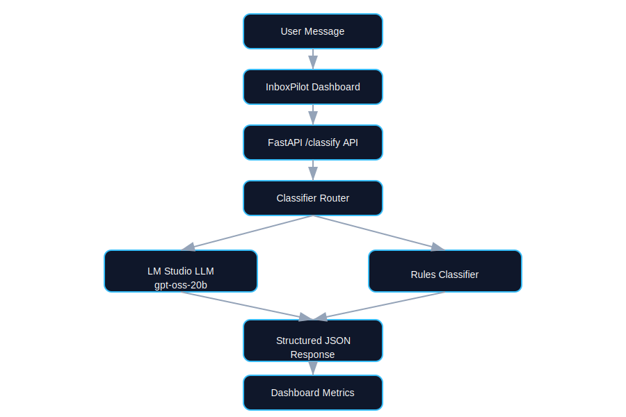

# InboxPilot Lite - Local Support Copilot

[](https://github.com/muhammednakooda783/ai-customer-support-triage-system/actions/workflows/ci.yml)
[](https://www.python.org/)
[](https://fastapi.tiangolo.com/)

InboxPilot Lite is a production-minded support copilot that classifies customer messages, drafts helpful replies, and gives operations visibility through a live dashboard.

It is designed for real-world reliability:
- Uses a **local LM Studio model** for richer AI output.
- Falls back to a deterministic **RulesClassifier** when LM output is unavailable/invalid.
- Includes request tracing, metrics, rate limiting, persistence, tests, and CI.

## What This Solves

Support teams lose time triaging repetitive inbound messages. InboxPilot Lite helps by:
- Auto-classifying intent (`question | complaint | sales | spam | other`)
- Suggesting response drafts
- Prioritizing and routing with `/copilot`
- Tracking quality/latency and recent activity in a dashboard

## Screenshots

Place screenshots in `docs/screenshots/` using these filenames (already referenced below):
- `swagger-classify-request.png`
- `swagger-classify-response.png`
- `dashboard-overview.png`
- `dashboard-recent-activity.png`
- `diagram.svg`

### API: Classify request


### API: Classify response


### Dashboard: overview


### Dashboard: recent activity


### Architecture diagram


## Architecture

```text
Frontend (React + Vite dashboard)
        |
        v
FastAPI Backend (app/main.py)
  - request_id middleware
  - rate limiting
  - metrics counters
  - /classify, /classify/batch, /copilot, /recent, /stats, /info, /health
        |
        +--> LMStudioClassifier (OpenAI-compatible local endpoint)
        |        |
        |        +--> robust JSON extraction + validation
        |        +--> fallback to RulesClassifier on failure
        |
        +--> SupportCopilotService
                 - intent -> priority + next_actions
                 - channel-aware draft replies
                 - templated fallback reply if LM drafting fails
        |
        +--> SQLite (request history + analytics)
```

## Tech Stack

- Python 3.11+
- FastAPI + Uvicorn
- Pydantic
- sqlite3 (stdlib)
- OpenAI Python client (for LM Studio OpenAI-compatible API)
- pytest + httpx
- Ruff + GitHub Actions
- Frontend: React + TypeScript + Tailwind + Recharts

## Quick Start

### 1) Backend setup

```bash
python -m venv .venv
```

Windows PowerShell:
```powershell
.venv\Scripts\Activate.ps1
```

macOS/Linux:
```bash
source .venv/bin/activate
```

Install dependencies:
```bash
pip install -r requirements.txt
```

Create env file:
```bash
cp .env.example .env
```

Recommended LM Studio vars:
```env
LMSTUDIO_BASE_URL=http://localhost:1234/v1
LMSTUDIO_API_KEY=lm-studio
LMSTUDIO_MODEL=openai/gpt-oss-20b
LMSTUDIO_TIMEOUT_SECONDS=20
REVIEW_THRESHOLD=0.70
```

### 2) Run backend

```bash
uvicorn app.main:app --reload --host 127.0.0.1 --port 8000
```

### 3) Run frontend dashboard

```bash
cd frontend
npm install
npm run dev
```

Open `http://localhost:5173`.

## API Summary

| Endpoint | Method | Purpose |
|---|---|---|
| `/health` | GET | Liveness check |
| `/info` | GET | Active classifier + model + version |
| `/metrics` | GET | In-memory counters |
| `/recent` | GET | Recent classified requests with filters |
| `/stats` | GET | Aggregate metrics window |
| `/review` | GET | Items awaiting human review |
| `/review/{request_id}` | POST | Submit reviewed category + final reply |
| `/classify` | POST | Single message classification |
| `/classify/batch` | POST | Batch classification |
| `/copilot` | POST | Intent + priority + next actions + draft reply |

### Example: `/classify`

```bash
curl -X POST http://127.0.0.1:8000/classify \
  -H "Content-Type: application/json" \
  -d '{"text":"I want a refund. Item is broken."}'
```

Example response:
```json
{
  "category": "complaint",
  "confidence": 0.95,
  "suggested_reply": "I'm sorry to hear that your item is broken. Please provide your order number and a brief description of the issue so we can process your refund promptly.",
  "classifier_used": "lmstudio",
  "latency_ms": 6785,
  "request_id": "3d542dd1-a96e-4e5f-bf68-62c563cf5dda"
}
```

### Example: `/copilot`

```bash
curl -X POST http://127.0.0.1:8000/copilot \
  -H "Content-Type: application/json" \
  -d '{"text":"I need a refund, product arrived damaged","channel":"email"}'
```

Example response:
```json
{
  "intent": {
    "category": "complaint",
    "confidence": 0.95
  },
  "priority": "high",
  "next_actions": [
    "Apologize and acknowledge the issue",
    "Ask for order number / reference",
    "Confirm refund/replacement preference"
  ],
  "draft_reply": "I am sorry this happened. Please share your order number so we can arrange a refund or replacement right away.",
  "classifier_used": "lmstudio",
  "latency_ms": 7012,
  "request_id": "ea291233-bf04-4d84-a3ed-6798b49f1d1a"
}
```

## Reliability and Fallback Behavior

- If LM Studio returns extra text or multiple JSON objects, the backend extracts the first valid JSON object.
- If output is malformed or required fields are missing, the service logs the reason and falls back to `RulesClassifier`.
- If LM Studio is unreachable, classification and copilot drafting continue with deterministic fallbacks.

## Testing and Quality

Run tests:
```bash
pytest -q
```

Run lint/format checks:
```bash
ruff check .
ruff format --check .
```

## Project Structure

```text
app/
  core/
    config.py
    metrics.py
    rate_limit.py
  models/
    schemas.py
  services/
    classifier.py
    lmstudio_classifier.py
    copilot.py
  db.py
  main.py
frontend/
  (React + TypeScript dashboard)
tests/
  test_classify.py
  test_copilot.py
  test_evaluate.py
scripts/
  evaluate.py
data/
  eval_dataset.jsonl
artifacts/
  eval/
```

## Roadmap

1. Add authentication and role-based dashboard access.
2. Add Prometheus/OpenTelemetry for richer production observability.
3. Add async queue processing for large batch requests.
4. Add human-in-the-loop review mode and feedback learning loop.
5. Add deploy templates for Render/Fly.io/Azure.
